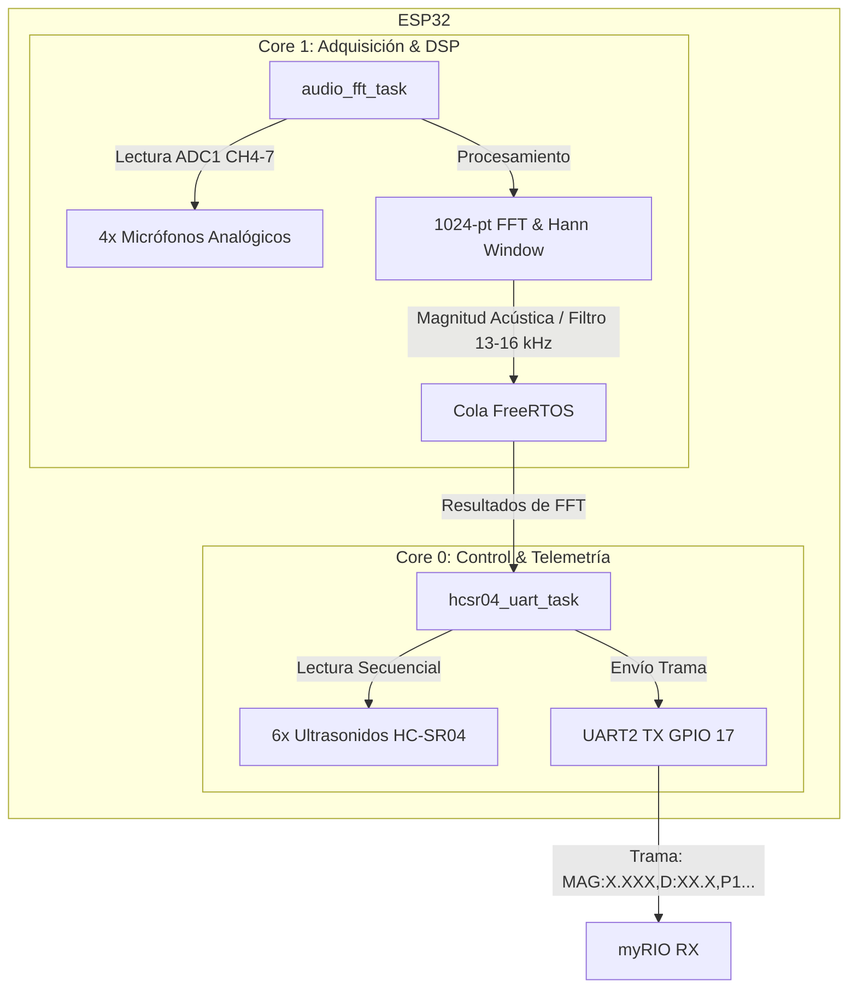

# Firmware del Robot Inspector de Fugas de Tuberías

Este directorio contiene el firmware de control del microcontrolador **ESP32** encargado del procesamiento digital de señales acústicas (DSP) y sensores de proximidad ultrasónicos, así como las herramientas en **Python** para adquisición de datos, análisis espectral de fugas en tiempo real y visualización de registros.

---

## 📂 Estructura de Carpetas Organizada

La carpeta de Firmware se ha estructurado de la siguiente forma para separar el código de producción, los scripts de análisis y los datos recolectados:

```text
Firmware/
├── README.md               # Este archivo de documentación
└── ESP32/                  # Proyecto principal en ESP-IDF (C/C++)
    ├── main/               # Código fuente del firmware
    │   ├── main.c          # Código principal (Dual-Core: FFT + Sonar + Telemetría)
    │   ├── main_normal.c   # Versión simplificada del firmware principal
    │   ├── calibrate.c     # Rutina de calibración y prueba de sensores
    │   ├── CMakeLists.txt  # Configuración de compilación del módulo principal
    │   └── idf_component.yml # Dependencia oficial para la librería esp-dsp
    ├── scripts/            # Scripts en Python de análisis y telemetría
    │   ├── log_data.py     # Registro en vivo de telemetría UART a archivos CSV
    │   ├── plot_log.py     # Visualización gráfica de los históricos de sensores (CSV a PNG)
    │   ├── FFT.py          # Visualización en vivo y captura de espectros FFT por puerto serial
    │   ├── plot_spectrum.py # Capturador y promediador de firmas de fuga de frecuencia (Hz)
    │   └── robot_guide.py  # Script de guía interactiva durante experimentos en tuberías
    ├── data/               # Historial de registros CSV y gráficos generados
    │   ├── sensor_log_*.csv  # Logs crudos de pruebas
    │   ├── sensor_log_*.png  # Gráficas automáticas de presión y proximidad
    │   └── leak_signature_*.csv # Firmas espectrales de fugas capturadas
    ├── sdkconfig           # Configuración del proyecto ESP-IDF
    └── CMakeLists.txt      # Archivo de construcción global del proyecto
```

---

## ⚡ Arquitectura del Firmware (ESP32)

El firmware está desarrollado sobre **ESP-IDF v5.x/v6.x** utilizando capacidades **Dual-Core** y multitarea con **FreeRTOS** para garantizar procesamiento de audio en tiempo real y lecturas de telemetría sin latencia.

### Distribución de Tareas en Núcleos



1. **Núcleo 1 (Procesamiento de Audio - `audio_fft_task`)**:
   - Muestrea secuencialmente **4 micrófonos analógicos** a una frecuencia de muestreo de **20 kHz por canal** usando el ADC1 (para no interferir con la antena WiFi/BT).
   - Aplica una ventana de **Hann** para reducir el leakage espectral y calcula una **FFT de 1024 puntos** por micrófono mediante hardware asistido por la librería **`esp_dsp`**.
   - Filtra y promedia las magnitudes en la banda crítica de fugas (**13 kHz – 16 kHz**).
   - Envía el promedio de la magnitud acústica (`MAG`) a una cola de FreeRTOS.

2. **Núcleo 0 (Proximidad y Telemetría - `hcsr04_uart_task`)**:
   - Realiza lecturas secuenciales de hasta **6 sensores de ultrasonido HC-SR04** para detección de obstáculos y posicionamiento del robot en la tubería.
   - Recibe la magnitud del análisis espectral de fugas (`MAG`) desde la cola.
   - Genera una trama estructurada y la envía a través de **UART2** (115200 baudios) al controlador de tracción (NI myRIO).

> [!IMPORTANT]
> **Trama de Telemetría UART:**
> `MAG:<Magnitud_Fuga>,D:<Distancia_HCSR04>,P1:<Proximidad1>,P2:<Proximidad2>,P3:<Proximidad3>\n`
> Esta trama es enviada continuamente para que el robot decida detenerse si detecta una fuga (alta `MAG`) o un obstáculo (baja `D` o valores de proximidad en `P1`/`P2`/`P3` por debajo de `PROXIMITY_THRESHOLD_CM`).

---

## 🔌 Asignación de Pines (Pinout)

Todos los sensores analógicos están conectados al bloque **ADC1** debido a restricciones de ESP-IDF cuando se activan módulos inalámbricos o de control.

| Sensor / Puerto | Pin GPIO (ESP32) | Función | Detalles / Canal ADC |
| :--- | :--- | :--- | :--- |
| **Micrófono 0** | GPIO 32 | Entrada Analógica | `ADC1_CH4` |
| **Micrófono 1** | GPIO 33 | Entrada Analógica | `ADC1_CH5` |
| **Micrófono 2** | GPIO 34 | Entrada Analógica | `ADC1_CH6` (Solo Entrada) |
| **Micrófono 3** | GPIO 35 | Entrada Analógica | `ADC1_CH7` (Solo Entrada) |
| **HC-SR04 Main (Distancia)** | TRIG: GPIO 4 / ECHO: GPIO 5 | Distancia Frontal | Sensor principal de trayectoria |
| **HC-SR04 P1** | TRIG: GPIO 18 / ECHO: GPIO 19| Detección de Pared 1 | Sensor de alineación lateral |
| **HC-SR04 P2** | TRIG: GPIO 21 / ECHO: GPIO 22| Detección de Pared 2 | Sensor de alineación lateral |
| **HC-SR04 P3** | TRIG: GPIO 23 / ECHO: GPIO 25| Detección de Pared 3 | Sensor de alineación lateral |
| **UART2 TX** | GPIO 17 | Transmisión de datos | Conexión al RX del controlador myRIO |
| **UART2 RX** | GPIO 16 | Recepción de datos | Sin uso en la versión actual |

---

## 🛠️ Compilación y Flasheo del Firmware

Se requiere tener instalado el entorno **ESP-IDF** (versión 5.1 o superior recomendada).

```bash
# 1. Navegar al proyecto ESP32
cd Firmware/ESP32

# 2. Configurar la arquitectura (ESP32 clásica)
idf.py set-target esp32

# 3. Compilar el proyecto
idf.py build

# 4. Flashear y abrir el monitor serial
# Reemplaza /dev/ttyUSB0 con tu puerto local asignado
idf.py -p /dev/ttyUSB0 flash monitor
```

---

## 🐍 Guía de Uso de Herramientas Python (scripts/)

Los scripts de Python permiten registrar y graficar experimentos en tiempo real conectando el ESP32 a la computadora vía USB-Serial.

> [!NOTE]
> Todos los scripts de Python han sido actualizados para guardar sus salidas automáticamente dentro de la carpeta `Firmware/ESP32/data/` para mantener ordenada la raíz del proyecto.

### 1. Visualización de Espectro en Tiempo Real (`FFT.py`)
Muestra un gráfico dinámico del espectro de frecuencia capturado por los micrófonos del robot.
```bash
python scripts/FFT.py --port /dev/ttyUSB0 --maxfreq 10000
```

### 2. Registro de Telemetría (`log_data.py`)
Captura los datos del puerto serial de telemetría y los guarda en un archivo estructurado CSV de forma continua.
```bash
python scripts/log_data.py --port /dev/ttyUSB0
# Genera: data/sensor_log_YYYYMMDD_HHMMSS.csv
```

### 3. Generación de Gráficas Estáticas (`plot_log.py`)
Genera automáticamente imágenes en formato PNG a partir de los datos crudos `.csv` guardados en la carpeta `data/`.
```bash
python scripts/plot_log.py data/sensor_log_20260619_171421.csv
# Genera: data/sensor_log_20260619_171421.png con trazas de magnitudes y distancias
```

### 4. Captura de Firmas Espectrales (`plot_spectrum.py`)
Muestra el espectro en tiempo real y permite promediar y exportar una firma de fuga definitiva.
* **Tecla `S`:** Presionar en la ventana de visualización para exportar la firma espectral promedio de la fuga a un archivo `.csv`.
```bash
python scripts/plot_spectrum.py --port /dev/ttyUSB0
# Genera: data/leak_signature_1781908096.csv
```

### 5. Guía de Experimentos (`robot_guide.py`)
Asistente interactivo en consola para documentar ensayos en la maqueta de tuberías, pidiendo descripciones de la prueba y registrando datos del comportamiento del robot paso a paso.
```bash
python scripts/robot_guide.py --port /dev/ttyUSB0
# Genera: data/robot_guide_log_YYYYMMDD_HHMMSS.csv
```
